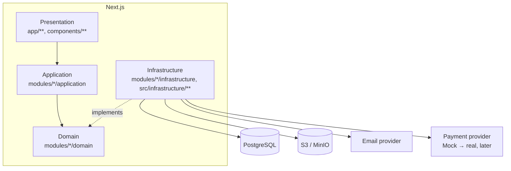

# Архитектура

## Почему модульный монолит

Три варианта рассматривались: простой монолит без внутренней структуры,
микросервисы, модульный монолит. Микросервисы на старте проекта добавляют
операционную сложность (сеть, деплой, распределённые транзакции), не
принося пользы при текущем масштабе. Монолит без структуры быстро превращается
в нечитаемый код, где бизнес-логика, UI и инфраструктура перемешаны.

Модульный монолит — один деплой-юнит, но с чёткими внутренними границами
между доменными модулями (`auth`, `models`, `orders`, ...) и между слоями
внутри каждого модуля. Если в будущем какой-то модуль (например, `payments`
или `downloads`) потребуется вынести в отдельный сервис — его границы уже
существуют: нужно будет только заменить внутренний вызов на сетевой.

## Слои

```text
Presentation   → страницы (app/**), React-компоненты, формы, Server Actions/Route Handlers
Application    → use cases: RegisterUser, CreateOrder, ConfirmPayment, ...
Domain         → бизнес-правила, entities, value objects, domain errors, интерфейсы
Infrastructure → Prisma-репозитории, S3, email, платёжный провайдер, логирование
```

Правило зависимостей — **сверху вниз, никогда наоборот**:

```text
UI  →  Use case  →  Interface (domain)  →  Infrastructure implementation
```

Domain **не зависит** от Next.js/React/Prisma/S3/конкретного платёжного SDK —
он оперирует только своими интерфейсами (например, `PaymentProvider` в
`src/infrastructure/payments/payment-provider.ts`, реализуемым Mock- или
позже реальным провайдером).

## Диаграмма



## Карта репозитория: что где физически лежит

Разделы выше объясняют принципы (слои, границы модулей). Этот раздел —
буквальная карта файловой системы, сверенная с реальным деревом `src/`, а
не идеализированная схема. Если этот раздел разойдётся с кодом — доверяйте
коду и правьте раздел, а не наоборот.

### `src/app/` — роуты Next.js App Router

```text
src/app/
├── layout.tsx              корневой layout: только <html>/<body> + metadata,
│                            БЕЗ шапки/футера — они добавляются ниже, per
│                            route-group, не глобально
├── (auth)/                  route group (URL без префикса /(auth)/):
│   │                        /login, /register, /forgot-password, /reset-password/[token]
│   ├── layout.tsx             оборачивает в <SiteChrome> (шапка+футер)
│   └── _components/            общие куски auth-форм (auth-card, form-field,
│                                submit-button) — "_" перед именем папки =
│                                конвенция Next.js "это не роут", просто
│                                обычная папка, недоступная как URL
├── (public)/                 route group: главная, /models, /models/[slug],
│   │                          /cart, /custom-order, /for-authors, /terms,
│   │                          /license, /tag/[slug] (SEO-страница тега, см.
│   │                          "## SEO" ниже — не путать с
│   │                          /models?tag=<slug>, фильтром каталога)
│   └── layout.tsx               тоже <SiteChrome>
├── admin/                      /admin/** — СОВСЕМ отдельный shell, без
│   │                            <SiteChrome>: своя AdminSidebar, и
│   │                            requireAdmin() проверяется в layout.tsx на
│   │                            КАЖДЫЙ запрос (см. `## Admin authorization`
│   │                            в SECURITY.md) — не JS-состояние, реальный
│   │                            серверный редирект на /login при отказе
│   └── */actions.ts               Server Actions конкретных admin-экранов
│                                    (models, custom-orders, tags, payouts)
├── profile/                    /profile/** — тоже <SiteChrome>, плюс
│                                собственная таб-навигация (ProfileShell)
├── api/                         ЕДИНСТВЕННЫЕ 4 настоящих HTTP Route Handler
│                                во всём приложении:
│                                  GET  /api/health
│                                  GET  /api/models/[slug]/viewer-url
│                                  POST /api/payments/webhook
│                                  POST /api/payments/mock/complete
│                                Всё остальное состояние меняется через
│                                Server Actions, не через свои API-роуты —
│                                см. API.md#server-actions.
├── checkout/mock/[providerPaymentId]/  экран mock-шлюза оплаты — намеренно
│                                         БЕЗ <SiteChrome> (у реального
│                                         платёжного провайдера тоже не было
│                                         бы нашей шапки/футера, это имитация
│                                         внешней страницы)
├── error.tsx, not-found.tsx, robots.ts, sitemap.ts, globals.css
│                                стандартные файлы уровня приложения (Next.js
│                                конвенции, не наш код)
```

Внутри каждого роута `_components/` (и изредка `_lib/`, `_actions.ts`,
`_status.ts`) — компоненты/хелперы, нужные только этому роуту и его
подстраницам. Это принципиально ОТДЕЛЬНОЕ место от `src/components/shared/`
и от `modules/*/presentation/` — правило разделения см. ниже.

### `src/components/shared/` — UI, не привязанный к одному роуту

Не модуль, не роут. Два разных повода компоненту оказаться здесь:

- **Сквозной chrome, рендерящийся на любой странице** через `<SiteChrome>`
  (шапка, футер, лого, ссылки навигации, бейдж корзины, кнопка выхода).
- **Компонент, переиспользуемый 2+ несвязанными роутами** — например,
  `breadcrumbs.tsx` (страница модели + `/tag/[slug]`) и `pagination-nav.tsx`
  (каталог + `/tag/[slug]`), оба перенесены сюда из `models/_components/`
  именно в момент, когда появился второй потребитель (SEO-аудит,
  2026-09-21) — до этого честно лежали в `_components/` одного роута.

Правило: если компонент не привязан к одному роуту и не является бизнес-логикой
конкретного модуля — он здесь, а не в `_components/` какого-то роута и не в
`modules/*/presentation/`.

### UI: три места, три разных правила

| Где | Когда | Пример |
| --- | --- | --- |
| `src/app/<роут>/_components/` | UI нужен только этому роуту/его вложенным страницам — подавляющее большинство случаев | `admin/models/_components/model-form.tsx` |
| `src/components/shared/` | UI на каждой странице сайта, либо переиспользуется 2+ несвязанными роутами | `site-header.tsx`, `cart-badge.tsx`, `breadcrumbs.tsx` |
| `modules/<name>/presentation/` | **Server Action**, используемый из нескольких НЕСВЯЗАННЫХ роутов — тогда логичнее держать его в модуле, а не дублировать/импортировать из чужого роута | см. ниже |

`presentation/` есть только у 2 из 15 модулей — это не "опциональный слой
по умолчанию", а редкое исключение:

- **`files/presentation/actions.ts`** (`requestUploadUrlAction`) — вызывается
  из 4 не связанных друг с другом мест: формы custom-order, admin-загрузки
  превью и STL, загрузки аватара в профиле. Один Server Action на все presigned-upload сценарии, а не 4 копии.
- **`custom-orders/presentation/actions.ts`** — используется и публичной
  формой заявки, и admin-экраном заявок.

Во всех остальных 13 модулях Server Actions живут рядом с роутом, который
их использует (`src/app/admin/models/actions.ts`,
`src/app/profile/actions.ts`, ...), а не внутри модуля.

### Слои по модулям — что реально есть, а что нет

`domain/` и `application/` есть у всех 15 модулей без исключений.
`infrastructure/` и `presentation/` — нет:

| Модуль | infrastructure/ | presentation/ | UI фактически живёт в |
| --- | --- | --- | --- |
| `admin` | — (только read-side агрегация, см. ниже) | — | `src/app/admin/**` |
| `audit` | ✓ | — | нет UI, сквозной сервис |
| `auth` | ✓ | — | `src/app/(auth)/**` |
| `authors` | ✓ | — | `src/app/profile/author/**` |
| `cart` | ✓ | — | `src/app/(public)/cart/**`, `cart-badge.tsx` |
| `catalog` | ✓ | — | `src/app/(public)/models/**`, главная |
| `custom-orders` | ✓ | ✓ | `(public)/custom-order/**` + `admin/custom-orders/**` |
| `downloads` | ✓ | — | `src/app/profile/purchases/**` |
| `files` | — (зовёт `@infrastructure/storage`) | ✓ | 4 роута, см. выше |
| `models` | ✓ | — | `admin/models/**`, `(public)/models/[slug]/**` |
| `notifications` | — (зовёт `@infrastructure/email`) | — | нет UI |
| `orders` | ✓ | — | `(public)/cart/**`, `profile/purchases/**` |
| `payments` | ✓ | — | `app/api/payments/**`, `app/checkout/**` |
| `tags` | ✓ | — | `admin/tags/**` |
| `users` | ✓ | — | `profile/**` |

`admin` и `notifications` без `infrastructure/` — не недосмотр: `admin`
только читает данные других модулей одним агрегирующим запросом (никакого
своего состояния для записи), `notifications` целиком делегирует отправку в
`@infrastructure/email`, ему нечего инкапсулировать самому.

### `src/shared/*` и `src/infrastructure/*` — не модули, а общая инфраструктура

Отличие от `src/modules/*`: код здесь не относится ни к одной конкретной
бизнес-сущности, им пользуются многие/все модули.

```text
shared/config/          Zod-валидация env при старте (env.ts), typed-доступ (index.ts)
shared/errors/           иерархия ошибок + handle-error.ts (единая точка на клиент)
shared/http/              with-api-handler.ts — обёртка над Route Handler'ами:
                            requestId, try/catch → handle-error, логирование
shared/logging/            pino + посуточная ротация + requestId context
shared/utils/               slugify.ts, clsx.ts — мелкие чистые хелперы;
                              json-ld.ts — безопасная сериализация JSON-LD
                              для dangerouslySetInnerHTML, см. SECURITY.md#xss
shared/constants/            catalog-tags.ts — ТОЛЬКО seed-бутстрап для
                              db:seed, не источник правды в рантайме (теги
                              теперь admin-managed, см. модуль `tags`)

infrastructure/database/      Prisma client singleton
infrastructure/storage/        S3: два клиента (внутренний/публичный), см.
                                 "Два S3-клиента" ниже
infrastructure/email/           EmailProvider интерфейс + console/smtp реализации
infrastructure/payments/         PaymentProvider интерфейс + Mock реализация
infrastructure/jobs/              Postgres-очередь + register-handlers.ts + worker.ts
infrastructure/rate-limit/         fixed-window лимитер на RateLimitBucket
```

## Модули (`src/modules/*`)

```text
auth            сессии, вход/регистрация, password reset
users           профиль пользователя
models          сущность Model + CRUD (админ), файлы/превью модели
catalog         публичный каталог: поиск/фильтр/сортировка/пагинация,
                похожие модели (listRelatedModels)
tags            теги/категории моделей, полное admin CRUD (/admin/tags) —
                не захардкожены
cart            корзина
orders          заказы, серверный расчёт стоимости
payments        Payment, PaymentProvider интерфейс, webhook-обработка
downloads       авторизация скачивания, signed URLs
custom-orders   заявки на индивидуальное моделирование
authors         баланс/продажи/выплаты авторов моделей (расширение, см. ниже)
admin           админ-панель (агрегирует данные остальных модулей)
files           presigned upload/download, валидация файлов
notifications   email-уведомления (password reset, статусы заявок)
audit           audit trail: запись + чтение критических событий
```

Каждый модуль обязательно содержит `domain/` и `application/`.
`infrastructure/` и `presentation/` — не у всех: какой модуль что реально
содержит и почему — см. таблицу «Слои по модулям» в разделе «Карта
репозитория» выше, не считайте этот список идеализированным шаблоном.

Публичный контракт модуля — файл `index.ts` в его корне. Другие модули и
`app/**` должны импортировать **только из него**, никогда напрямую из
`application/*` или `infrastructure/*` соседнего модуля — это единственное
место, которое обязано оставаться стабильным при рефакторинге внутренностей
модуля.

### Модуль `admin`

`src/modules/admin` сейчас содержит только read-side агрегацию для
дашборда (`getDashboardStats`, `getUsersAndPaymentsOverview`) — статистику
продаж/пользователей/платежей, собранную из других модулей одним запросом,
специально под экран `/admin`. Write-side админки (создание/редактирование/
публикация модели, смена статуса custom order) реализована не как отдельный
CRUD-слой в `admin`, а как расширение write-стороны уже существующих модулей
(`@modules/models` — `createModel`/`updateModel`/`publishModel`/`hideModel`/
`addModelImage`/`addModelFile`; `@modules/custom-orders` —
`updateCustomOrderStatus`) — авторизация (`requireAdmin()`) проверяется в
каждом use case или в вызывающей Server Action, ownership бизнес-правил
остаётся там же, где и остальная бизнес-логика модели/заявки, а не
дублируется в `admin`.

`src/app/admin/**` (Presentation) — отдельный UI-shell
(`src/app/admin/layout.tsx`, проверяет `requireAdmin()` на каждый запрос,
редиректит на `/login` иначе) со своими страницами
(`models`, `models/new`, `models/[id]`, `custom-orders`,
`custom-orders/[id]`) и Server Actions (`src/app/admin/models/actions.ts`,
`src/app/admin/custom-orders/actions.ts`) — новых `app/api/**` Route
Handlers админка не добавляет, см. [API.md](./API.md#server-actions-остальная-часть-приложения).

### Расширение: модуль `authors`

В ТЗ раздел 9 не описывает продажу моделей пользователями — по ТЗ каталог
полностью управляется администратором. Однако PDF-дизайн (стр. 13–15
макета) содержит полноценный «Кабинет автора»: баланс, история продаж по
моделям, комиссия площадки, запрос выплаты.

После уточнения у владельца продукта: администратор сам публикует модель
и указывает существующего зарегистрированного пользователя автором (через
email — с валидацией, что такой пользователь существует). Self-service
загрузки моделей пользователями нет. Пользователь видит вкладку «Кабинет
автора» в профиле, если ему принадлежит (как автору) хотя бы одна модель.

Это потребовало расширить схему БД сверх базового списка ТЗ §12:
`Model.authorId` (nullable FK на User), `OrderItem.authorId` /
`commissionBps` / `authorEarningAmount` (snapshot на момент оплаты — тот же
паттерн, что уже используется в ТЗ для `priceSnapshot`/`titleSnapshot`), и
новая сущность `AuthorPayout`. Подробности — [DATABASE.md](./DATABASE.md).

## База данных

PostgreSQL + Prisma. Схема — `prisma/schema.prisma`, миграции —
`prisma/migrations/`. Полное описание сущностей, связей, индексов и ER-диаграмма
— [DATABASE.md](./DATABASE.md).

## Хранилище файлов

S3-совместимое (MinIO в dev). STL-файлы никогда не проходят через
application-сервер целиком для больших объёмов — используется схема с
presigned URL:

```text
Upload:   Browser → запрос upload URL у Next.js → Next.js выдаёт signed PUT URL → Browser грузит файл напрямую в S3 → метаданные сохраняются в БД
Download: Browser → authenticated request → проверка владения (ownership) → Next.js выдаёт signed GET URL → Browser скачивает напрямую из S3
```

Ключи хранилища сегментированы по префиксам (`src/shared/config/index.ts`):
`models/`, `avatars/`, `custom-orders/`, `previews/`. Ключ всегда
случайный (`generateStorageKey`), никогда не строится из оригинального
имени файла — см. [SECURITY.md](./SECURITY.md#файлы).

### Два S3-клиента: внутренний и публичный

`src/infrastructure/storage/s3-client.ts` создаёт **два** разных
`S3Client`, а не один:

- `getS3Client()` — endpoint `S3_ENDPOINT` (в dev — `http://minio:9000`,
  внутренний Docker-хостнейм). Используется только для серверных вызовов,
  которые никогда не покидают процесс: `HeadObjectCommand`,
  `DeleteObjectCommand`.
- `getPublicS3Client()` — endpoint `S3_PUBLIC_HOST_FOR_CSP` (в dev —
  `http://localhost:9000`, с фолбэком на `S3_ENDPOINT`, если переменная не
  задана). Используется **везде**, где presigned URL получит и вызовет сам
  браузер: `createPresignedUploadUrl` (PUT) и `createPresignedDownloadUrl`
  (GET) в `storage-service.ts`.

Почему нельзя одним клиентом: presigned URL — это SigV4-подпись, в которую
включён хост назначения. Если подписать запрос клиентом с внутренним
эндпоинтом, а потом просто заменить хост в URL на публичный (строковая
замена), подпись становится невалидной — сервер ответит `SignatureDoesNotMatch`.
Правильный хост нужно передать клиенту **в момент подписи**, поэтому два
отдельных клиента, а не один + постобработка URL.

Symptom, если это перепутать: `fetch(uploadUrl, { method: "PUT" })` в
браузере падает с `TypeError: Failed to fetch`, потому что браузер физически
не может разрешить/достучаться до внутреннего Docker-хостнейма — это баг,
который был найден и исправлен в этом проекте (presigned URL раньше
подписывались только `getS3Client()`).

## 3D-просмотр модели

`src/app/(public)/models/[slug]/_components/model-viewer.tsx` — клиентский
компонент (`"use client"`), загружаемый через `next/dynamic(ssr:false)` из
`Gallery`, только когда посетитель выбирает вкладку "3D" (WebGL/three.js
бандл не попадает в первый экран, если он не нужен). Рендерит STL через
`@react-three/fiber` (`useLoader(STLLoader, url)`) + `OrbitControls` из
`@react-three/drei`. URL модели получает от `/api/models/[slug]/viewer-url`,
который выдаёт presigned GET URL на приватный `models/` префикс (см. выше)
— сырой storage key никогда не уходит в браузер.

> На момент написания 3D-просмотр использует тот же STL-файл, что продаётся
> покупателю, а не отдельную облегчённую/децимированную версию под
> превью — это осознанно оставлено на потом (см. известные ограничения
> ниже), не путать с багом.

### Грабли: Next.js 15 всегда навязывает свою версию React в клиентском бандле

`package.json` фиксирует `react`/`react-dom` на `~19.2.8`, но **это не то,
что фактически решает, какая версия React используется в браузере**. Next.js
webpack-конфиг для клиентских чанков (`app-pages-browser`) алиасит **любой**
`require("react")`/`import "react"` — включая изнутри `node_modules`
сторонних пакетов вроде `react-reconciler` — на свою вендоренную копию
`next/dist/compiled/react`. Версия этой копии зависит от версии самого
Next.js, а не от того, что указано в корневом `package.json` проекта.

Из-за этого `@react-three/fiber` v8 (собранный под React 18, зависящий от
`react-reconciler@0.27.0`) падал с
`TypeError: Cannot read properties of undefined (reading 'ReactCurrentOwner')`
сразу при загрузке модуля — даже когда `react`/`react-dom` в проекте были
явно запинены на `18.3.1`. Next 15 всё равно подсовывал React 19 в
клиентский бандл, и `react-reconciler@0.27.0` не находил в нём ожидаемый
`__SECRET_INTERNALS_DO_NOT_USE_OR_YOU_WILL_BE_FIRED` (React 19 переименовал
этот объект в `__CLIENT_INTERNALS_DO_NOT_USE_OR_WARN_USERS_THEY_CANNOT_UPGRADE`).

**Правило на будущее:** версия `react`/`react-dom` в этом проекте должна
соответствовать тому, что реально вендорит используемая версия Next.js
(проверяется по факту: `grep -o "exports.version = ..." node_modules/next/dist/compiled/react/cjs/react.development.js`
внутри контейнера), а версии `@react-three/fiber`/`@react-three/drei`
должны официально поддерживать именно эту major-версию React (текущий
рабочий набор: React `~19.2.8` + `@react-three/fiber@^9.7.0` +
`@react-three/drei@^10.7.8`). Обновление Next.js на новый major почти
наверняка снова сдвигает вендоренную версию React и требует синхронного
апдейта этой связки — типичный `npm run typecheck`/`npm run build` это
**не ловит** (ошибка чисто рантаймовая, в браузере), только реальная
загрузка страницы с 3D-моделью.

## Авторизация

Серверные сессии, а не JWT: токен сессии хранится в cookie (HttpOnly,
Secure в production, SameSite=Lax), а в БД — только его хэш (`Session.tokenHash`).
Реализация — `src/modules/auth`. Подробности — [SECURITY.md](./SECURITY.md).

Выход из аккаунта — `src/components/shared/logout-action.ts`, обычный
Server Action без JS-зависимостей (progressive enhancement: работает и как
`<form action={...}>` без клиентского JS), вызывает `logoutUser` из
`@modules/auth` и редиректит на `/`. Кнопка есть в хедере и в сайдбаре
профиля (`src/components/shared/logout-button.tsx`).

## Платежи

Реальный провайдер не подключён (согласно ТЗ §24). Бизнес-логика заказов
зависит только от интерфейса `PaymentProvider`
(`src/infrastructure/payments/payment-provider.ts`); используется
`MockPaymentProvider`. Подключение реального провайдера в будущем — это
новая реализация этого интерфейса в `src/infrastructure/payments/`, без
изменений в `orders`/`payments` application-слое.

## Логирование

Структурированные JSON-логи (pino) с посуточной ротацией в `logs/YYYY-MM-DD/`,
отдельно application/error/audit. Подробности — [LOGGING.md](./LOGGING.md).

## Background jobs

Лёгкая Postgres-очередь (`src/infrastructure/jobs`) без Redis/BullMQ (ТЗ §67
прямо запрещает вводить очередь "просто так"). Обработчики регистрируются в
`src/infrastructure/jobs/register-handlers.ts` и выполняются процессом
`npm run worker` (отдельный контейнер в `docker-compose.prod.yml`).
Используется, например, для отправки email и — при появлении
автогенерации STL-превью (ТЗ §68) — для тяжёлой обработки файлов, без
переписывания вызывающей бизнес-логики.

## Rate limiting

Собственный fixed-window лимитер на таблице `RateLimitBucket`
(`src/infrastructure/rate-limit`) — без внешней очереди/кеша. Верно для
однопроцессного/single-instance деплоя, к которому проект пока и относится;
при масштабировании на несколько инстансов заменяется на Redis-based
реализацию с тем же публичным API (`checkRateLimit`/`enforceRateLimit`), без
изменений в вызывающем коде.

## Наблюдаемость

- `GET /api/health` — проверяет приложение и PostgreSQL
- `requestId` на каждый HTTP-запрос, присутствует в логах и audit-событиях
  (`src/middleware.ts` + `src/shared/http/with-api-handler.ts`)
- Единая иерархия ошибок (`src/shared/errors`) — клиент никогда не видит
  stack trace, полная информация уходит в server-логи

## SEO

Полный аудит и обоснования — история изменений; здесь только устойчивая
архитектурная суть (SEO-аудит, 2026-09-21).

### Ручной override vs автоматика

`Model` (`seoTitle`, `seoDescription`, `noindex`) и `Tag`
(`seoIndexed`, `seoTitle`, `seoH1`, `seoDescription`) — все поля nullable,
пусто = используется автоматическое значение. Никакого отдельного поля под
canonical или H1 для модели не заведено: canonical модели всегда
`/models/{slug}`, H1 всегда `title` — по определению, заводить override для
того, что не должно расходиться с основным полем, значило бы просто
дублировать данные, которые могут разъехаться без пользы. Тот же принцип у
тега — canonical всегда `/tag/{slug}`.

Title всегда возвращается **без** суффикса "— Моделкин" — этот суффикс
добавляет `title.template` в `src/app/layout.tsx` **на все страницы
автоматически**. Дописывать его вручную в `generateMetadata`/`metadata`
нельзя — задваивается (`"... — Моделкин — Моделкин"`), это реальный баг,
найденный и исправленный на `/custom-order` в ходе аудита.

### Теги: фильтр по умолчанию, SEO-страница — по явному включению

`Tag.seoIndexed` — `false` по умолчанию у каждого тега. Это осознанное
архитектурное решение, а не временное состояние: подавляющее большинство
тегов существует только для фильтрации/классификации и никогда не должно
становиться отдельной индексируемой страницей (иначе — SEO-мусор из тысяч
низкоценных страниц вида "чёрный", "круглый" и т.п.). `/models?tag=<slug>`
работает как фильтр **для любого тега** независимо от `seoIndexed` — это не
меняется. `/tag/[slug]` (`src/app/(public)/tag/[slug]/page.tsx`) —
ОТДЕЛЬНЫЙ, аддитивный маршрут, который существует только для тегов с
`seoIndexed = true` (иначе 404) и не заменяет фильтр, а дополняет его для
тегов, которые администратор счёл достаточно ценными.

### index/noindex

Приоритет — `robots` в page-level `metadata`/`generateMetadata`, а не
`robots.txt` (`src/app/robots.ts` держит только `/admin`, `/profile`,
`/cart`, `/checkout` для экономии crawl-бюджета — это вторично, реальный
контроль индексации через meta-тег). noindex стоит на: любом
`/models`-варианте с query-параметрами или `page > 1`, `/tag/[slug]?page >
1`, `/cart`, `/login`, `/register`, `/forgot-password`,
`/reset-password/[token]` (ещё и `nofollow` — см. SECURITY.md, токен в URL),
`/checkout/**`, `/terms`, `/license`. На noindex-странице с query-параметрами
canonical сознательно не проставляется вообще (не на саму себя, и не на
"чистый" URL) — смешивать noindex и canonical-в-другую-сторону даёт
краулеру противоречивый сигнал; если чистого noindex достаточно, лишний
canonical не нужен.

`sitemap.ts` — единственный источник правды о том, что реально должно
индексироваться: модели `status=PUBLISHED, noindex=false`, теги
`seoIndexed=true`, статические публичные страницы. Ничего служебного туда
никогда не сканируется автоматически (список статических роутов — руками
перечисленный литерал, а не обход файловой системы).

### JSON-LD

`Organization` + `WebSite`+`SearchAction` — глобально, `src/app/layout.tsx`.
`BreadcrumbList` — `components/shared/breadcrumbs.tsx` (страница модели,
`/tag/[slug]`). `Product`+`Offer`+`Brand` — страница модели
(`availability` всегда `InStock`: цифровой товар физически не может
закончиться). Никаких `Review`/`AggregateRating` — в продукте нет ни
отзывов, ни рейтингов, придумывать structured data под несуществующий
контент запрещено себе намеренно.

Любой JSON-LD в проект добавляется только через `toJsonLdScript()`
(`src/shared/utils/json-ld.ts`), никогда напрямую `JSON.stringify` +
`dangerouslySetInnerHTML` — см. SECURITY.md#xss.

## Внешние интеграции

| Что | Где | Статус |
| --- | --- | --- |
| S3-совместимое хранилище | `src/infrastructure/storage` | реализовано (AWS SDK v3, работает с MinIO) |
| Email | `src/infrastructure/email` | `console`-провайдер по умолчанию (пишет в лог), `smtp`-провайдер как real-hook |
| Платежи | `src/infrastructure/payments` | только Mock, интерфейс готов под реальный провайдер |

## Известные ограничения

- **3D-превью показывает тот же STL, что продаётся покупателю**, а не
  отдельную облегчённую/децимированную версию под просмотр. Технически
  ничего не мешает скачать полный файл через DevTools во время просмотра.
  Правильное решение — фоновая джоба (см. Background jobs выше), которая при
  публикации модели генерирует упрощённый `.glb` в отдельном публичном
  storage-префиксе, и `ModelViewer` переключается на него. Не сделано —
  ждёт отдельной задачи.
- **E2E-тесты (`tests/e2e/*.spec.ts`) написаны, но не запускались** — в
  среде разработки этого проекта не было доступа к CDN для установки
  Playwright/Chromium. Прогоняются в CI (`.github/workflows/ci.yml`) на
  обычном GitHub Actions раннере.
- **Реальный платёжный провайдер не подключён** (намеренно, см. раздел
  «Платежи» выше) — только `MockPaymentProvider`.
- **Редиректов для смены slug модели нет** — и не нужны: `updateModel`
  явно никогда не меняет slug после создания (см. комментарий в
  `application/update-model.ts`), в админке нет способа его изменить.
  Строить redirect-таблицу под функциональность, которой не существует,
  означало бы держать мёртвый код. Если возможность смены slug когда-нибудь
  появится — Prisma-схема этому не мешает, но добавлять её нужно будет
  одновременно с самой возможностью, не раньше.
- **Публичных страниц авторов нет** — «Кабинет автора» приватный (за
  `requireUser`), доступен только самому автору. `Person`/`author`-schema
  для моделей сознательно не добавлена в JSON-LD — добавлять разметку под
  сущность без публичной страницы, на которую она могла бы ссылаться, не
  имеет смысла.
