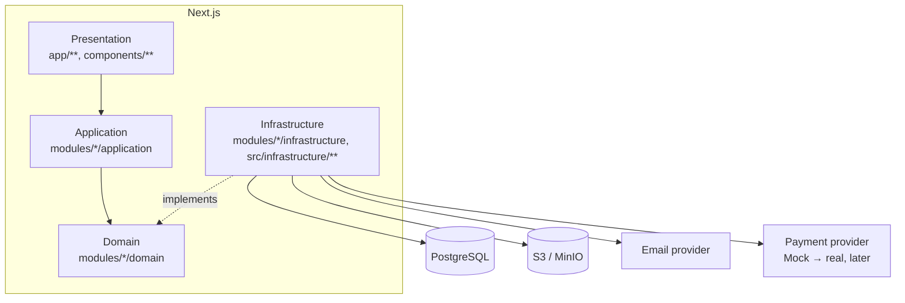

# Архитектура

## Почему модульный монолит

Три варианта рассматривались: простой монолит без внутренней структуры,
микросервисы, модульный монолит. Микросервисы на старте проекта добавляют
операционную сложность (сеть, деплой, распределённые транзакции), не
принося пользы при текущем масштабе. Монолит без структуры быстро превращается
в нечитаемый код, где бизнес-логика, UI и инфраструктура перемешаны.

Модульный монолит — один деплой-юнит, но с чёткими внутренними границами
между доменными модулями (`auth`, `models`, `orders`, ...) и между слоями
внутри каждого модуля. Если в будущем какой-то модуль (например, `payments`
или `downloads`) потребуется вынести в отдельный сервис — его границы уже
существуют: нужно будет только заменить внутренний вызов на сетевой.

## Слои

```text
Presentation   → страницы (app/**), React-компоненты, формы, Server Actions/Route Handlers
Application    → use cases: RegisterUser, CreateOrder, ConfirmPayment, ...
Domain         → бизнес-правила, entities, value objects, domain errors, интерфейсы
Infrastructure → Prisma-репозитории, S3, email, платёжный провайдер, логирование
```

Правило зависимостей — **сверху вниз, никогда наоборот**:

```text
UI  →  Use case  →  Interface (domain)  →  Infrastructure implementation
```

Domain **не зависит** от Next.js/React/Prisma/S3/конкретного платёжного SDK —
он оперирует только своими интерфейсами (например, `PaymentProvider` в
`src/infrastructure/payments/payment-provider.ts`, реализуемым Mock- или
позже реальным провайдером).

## Диаграмма



## Модули (`src/modules/*`)

```text
auth            сессии, вход/регистрация, password reset
users           профиль пользователя
models          сущность Model + CRUD (админ), файлы/превью модели
catalog         публичный каталог: поиск/фильтр/сортировка/пагинация
tags            теги моделей
cart            корзина
orders          заказы, серверный расчёт стоимости
payments        Payment, PaymentProvider интерфейс, webhook-обработка
downloads       авторизация скачивания, signed URLs
custom-orders   заявки на индивидуальное моделирование
authors         баланс/продажи/выплаты авторов моделей (расширение, см. ниже)
admin           админ-панель (агрегирует данные остальных модулей)
files           presigned upload/download, валидация файлов
notifications   email-уведомления (password reset, статусы заявок)
audit           audit trail: запись + чтение критических событий
```

Каждый модуль:

```text
modules/<name>/
├── domain/           entities, value objects, интерфейсы репозиториев
├── application/       use cases (по одному файлу на use case)
├── infrastructure/      Prisma-репозитории и другие конкретные реализации
└── presentation/         (опционально) компоненты/формы, специфичные модулю
```

Публичный контракт модуля — файл `index.ts` в его корне. Другие модули и
`app/**` должны импортировать **только из него**, никогда напрямую из
`application/*` или `infrastructure/*` соседнего модуля — это единственное
место, которое обязано оставаться стабильным при рефакторинге внутренностей
модуля.

### Расширение: модуль `authors`

В ТЗ раздел 9 не описывает продажу моделей пользователями — по ТЗ каталог
полностью управляется администратором. Однако PDF-дизайн (стр. 13–15
макета) содержит полноценный «Кабинет автора»: баланс, история продаж по
моделям, комиссия площадки, запрос выплаты.

После уточнения у владельца продукта: администратор сам публикует модель
и указывает существующего зарегистрированного пользователя автором (через
email — с валидацией, что такой пользователь существует). Self-service
загрузки моделей пользователями нет. Пользователь видит вкладку «Кабинет
автора» в профиле, если ему принадлежит (как автору) хотя бы одна модель.

Это потребовало расширить схему БД сверх базового списка ТЗ §12:
`Model.authorId` (nullable FK на User), `OrderItem.authorId` /
`commissionBps` / `authorEarningAmount` (snapshot на момент оплаты — тот же
паттерн, что уже используется в ТЗ для `priceSnapshot`/`titleSnapshot`), и
новая сущность `AuthorPayout`. Подробности — [DATABASE.md](./DATABASE.md).

## База данных

PostgreSQL + Prisma. Схема — `prisma/schema.prisma`, миграции —
`prisma/migrations/`. Полное описание сущностей, связей, индексов и ER-диаграмма
— [DATABASE.md](./DATABASE.md).

## Хранилище файлов

S3-совместимое (MinIO в dev). STL-файлы никогда не проходят через
application-сервер целиком для больших объёмов — используется схема с
presigned URL:

```text
Upload:   Browser → запрос upload URL у Next.js → Next.js выдаёт signed PUT URL → Browser грузит файл напрямую в S3 → метаданные сохраняются в БД
Download: Browser → authenticated request → проверка владения (ownership) → Next.js выдаёт signed GET URL → Browser скачивает напрямую из S3
```

Ключи хранилища сегментированы по префиксам (`src/shared/config/index.ts`):
`models/`, `avatars/`, `custom-orders/`, `previews/`. Ключ всегда
случайный (`generateStorageKey`), никогда не строится из оригинального
имени файла — см. [SECURITY.md](./SECURITY.md#файлы).

## Авторизация

Серверные сессии, а не JWT: токен сессии хранится в cookie (HttpOnly,
Secure в production, SameSite=Lax), а в БД — только его хэш (`Session.tokenHash`).
Реализация — `src/modules/auth`. Подробности — [SECURITY.md](./SECURITY.md).

## Платежи

Реальный провайдер не подключён (согласно ТЗ §24). Бизнес-логика заказов
зависит только от интерфейса `PaymentProvider`
(`src/infrastructure/payments/payment-provider.ts`); используется
`MockPaymentProvider`. Подключение реального провайдера в будущем — это
новая реализация этого интерфейса в `src/infrastructure/payments/`, без
изменений в `orders`/`payments` application-слое.

## Логирование

Структурированные JSON-логи (pino) с посуточной ротацией в `logs/YYYY-MM-DD/`,
отдельно application/error/audit. Подробности — [LOGGING.md](./LOGGING.md).

## Background jobs

Лёгкая Postgres-очередь (`src/infrastructure/jobs`) без Redis/BullMQ (ТЗ §67
прямо запрещает вводить очередь "просто так"). Обработчики регистрируются в
`src/infrastructure/jobs/register-handlers.ts` и выполняются процессом
`npm run worker` (отдельный контейнер в `docker-compose.prod.yml`).
Используется, например, для отправки email и — при появлении
автогенерации STL-превью (ТЗ §68) — для тяжёлой обработки файлов, без
переписывания вызывающей бизнес-логики.

## Rate limiting

Собственный fixed-window лимитер на таблице `RateLimitBucket`
(`src/infrastructure/rate-limit`) — без внешней очереди/кеша. Верно для
однопроцессного/single-instance деплоя, к которому проект пока и относится;
при масштабировании на несколько инстансов заменяется на Redis-based
реализацию с тем же публичным API (`checkRateLimit`/`enforceRateLimit`), без
изменений в вызывающем коде.

## Наблюдаемость

- `GET /api/health` — проверяет приложение и PostgreSQL
- `requestId` на каждый HTTP-запрос, присутствует в логах и audit-событиях
  (`src/middleware.ts` + `src/shared/http/with-api-handler.ts`)
- Единая иерархия ошибок (`src/shared/errors`) — клиент никогда не видит
  stack trace, полная информация уходит в server-логи

## Внешние интеграции

| Что | Где | Статус |
| --- | --- | --- |
| S3-совместимое хранилище | `src/infrastructure/storage` | реализовано (AWS SDK v3, работает с MinIO) |
| Email | `src/infrastructure/email` | `console`-провайдер по умолчанию (пишет в лог), `smtp`-провайдер как real-hook |
| Платежи | `src/infrastructure/payments` | только Mock, интерфейс готов под реальный провайдер |
